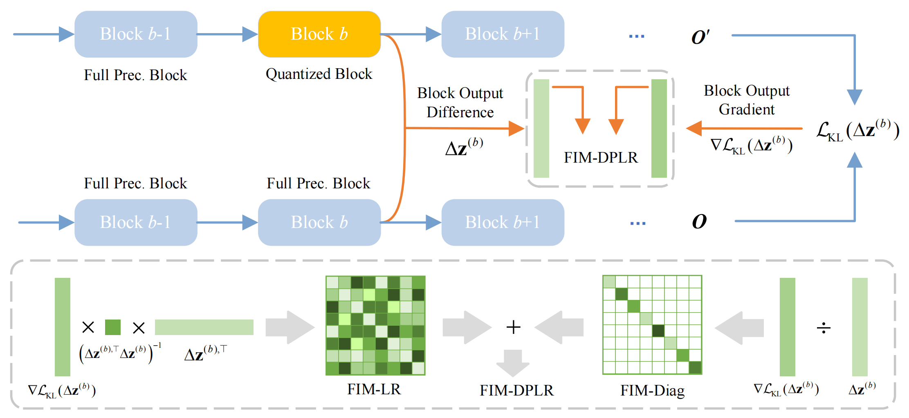

## FIMA-Q: Post-Training Quantization for Vision Transformers by Fisher Information Matrix Approximation

This repository contains the official PyTorch implementation for the CVPR 2025 paper "FIMA-Q: Post-Training Quantization for Vision Transformers by Fisher Information Matrix Approximation".



## Getting Started

- Clone this repo.

```bash
git clone git@github.com:ShiheWang/FIMA-Q.git
cd FIMA-Q
```

- Install pytorch and [timm](https://github.com/huggingface/pytorch-image-models/tree/main).
- **Note**: A higher version of pytorch may yield better results. The results reported in our paper were obtained using the following configurations:

```bash
pip install torch==1.10.0 torchvision --index-url https://download.pytorch.org/whl/cu113
pip install timm==0.9.2
```

All the pretrained models can be obtained using timm. You can also directly download the checkpoints we provide. For example:

```bash
wget https://github.com/GoatWu/AdaLog/releases/download/v1.0/deit_tiny_patch16_224.bin
mkdir -p ./checkpoint/vit_raw/
mv deit_tiny_patch16_224.bin ./checkpoint/vit_raw/
```

## Evaluation

You can quantize and evaluate a single model using the following command:

```bash
python test_quant.py --model <MODEL> --config <CONFIG_FILE> --dataset <DATA_DIR> [--reconstruct-mlp] [--load-reconstruct-checkpoint <RECON_CKPT>] [--calibrate] [--load-calibrate-checkpoint <CALIB_CKPT>] [--optimize]
```

- `--model <MODEL>`: Model architecture, which can be `deit_tiny`, `deit_small`, `deit_base`, `vit_tiny`, `vit_small`, `vit_base`, `swin_tiny`, `swin_small` and `swin_base`.

- `--config <CONFIG_FILE>`: Path to the model quantization configuration file.

- `--dataset <DATA_DIR>`: Path to ImageNet dataset.
- 
- `--calibrate` and `--load-calibrate-checkpoint <CALIB_CKPT>`: A `mutually_exclusive_group` to choose between quantizing an existing model or directly load a calibrated model. The default selection is `--calibrate`.

- `--optimize`: Wether to perform Adaround optimization after calibration.

Example: Optimize the model after calibration.

```bash
python test_quant.py --model vit_small --config ./configs/3bit/best.py --dataset ~/data/ILSVRC/Data/CLS-LOC --val-batch-size 500  --calibrate --optimize --optim-metric fisher_lr+diag
```

Example: Load a calibrated checkpoint, then run optimization.

```bash
python test_quant.py --model vit_small --config ./configs/3bit/best.py --dataset ~/data/ILSVRC/Data/CLS-LOC --val-batch-size 500 --load-reconstruct-checkpoint ./checkpoints/quant_result/vit_small_w3_a3_calibsize_128_mse.pth  --optimize --optim-metric fisher_lr+diag
```

Example: Load a optimized checkpoint and test.

```bash
python test_quant.py --model vit_small --config ./configs/3bit/best.py --dataset ~/data/ILSVRC/Data/CLS-LOC --val-batch-size 500 --load-optimize-checkpoint ./checkpoints/quant_result/vit_small_w3_a3_optimsize_1024_fisher_lr+diag_qdropq15.pth --test-optimize-checkpoint 
```

## Results

Below are the experimental results of our proposed APHQ-ViT that you should get on ImageNet dataset. Checkpoints are available in [Google Drive]().

| Model | **Full Prec.** | **W4/A4** | **W3/A3** |
|:----------:|:--------------:|:---------:|:---------:|
| **ViT-S**  | 81.39          | 76.68     | 64.09     |
| **ViT-B**  | 84.54          | 83.04     | 77.63     |
| **DeiT-T** | 72.21          | 66.84     | 55.55     |
| **DeiT-S** | 79.85          | 76.87     | 69.13     |
| **DeiT-B** | 81.80          | 80.33     | 76.54     |
| **Swin-S** | 83.23          | 81.82     | 77.26     |
| **Swin-B** | 85.27          | 83.60     | 78.82     |

## Citation

If you find our work useful in your research, please consider citing:

```bibtex
@inproceedings{wu2025fimaq,
title={FIMA-Q: Post-Training Quantization for Vision Transformers by Fisher Information Matrix Approximation},
author={Wu, Zhuguanyu and Wang, Shihe and Zhang, Jiayi and Chen, Jiaxin and Wang, Yunhong},
booktitle={IEEE/CVF Conference on Computer Vision and Pattern Recognition (CVPR)},
year={2025}
}
```